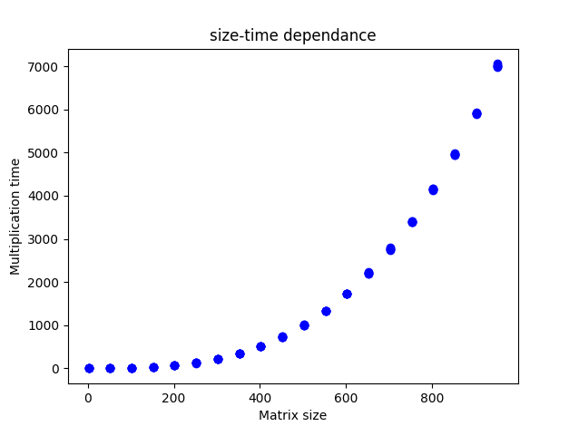

# Lab_1
### Задание 
Написать программу на языке C/C++ для перемножения двух матриц. Исходные данные: файл(ы) содержащие значения исходных матриц. Выходные данные: файл со значениями результирующей матрицы, время выполнения, объем задачи.Обязательна автоматизированная верификация результатов вычислений с помощью сторонних библиотек или стороннего ПО (например на Matlab/Python).
### Реализация
На языке C++ был реализован алгоритм произведения матриц, последующая проверка корректности результата производилась на Python с использованием библиотеки NumPy. 
### Тесты
Начальный размер матрицы - 2х2, количество шагов - 25, шаг увеличения размера - 50, испытаний для каждого размера - 5
### Результаты
Ниже приведен график зависимости среднего времени перемножения матриц от её размерности, для каждого испытания были построены доверительные интервалы с точностью 95%

### Вывод
Количество элементов в матрице, а значит и время, необходимое для перемножения таких матриц, зависит от квадрата стороны матрицы, что и отображено на графике(точные результаты тестов приведены в [этом файле](matrix_multiplication_results.csv))