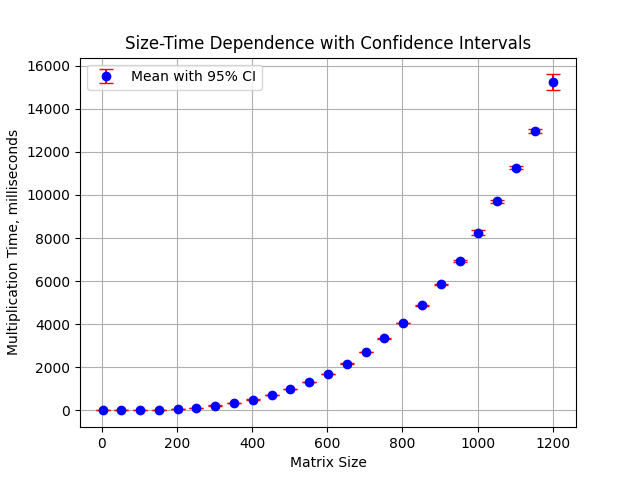

# Lab_1
#### на языке C++ был реализован алгоритм произведения матриц, последующая проверка корректности результата производится на Python с использованием библиотеки NumPy. График получившейся зависимости размер/время приведен ниже
