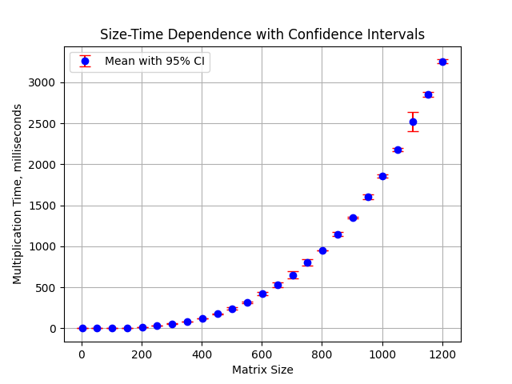
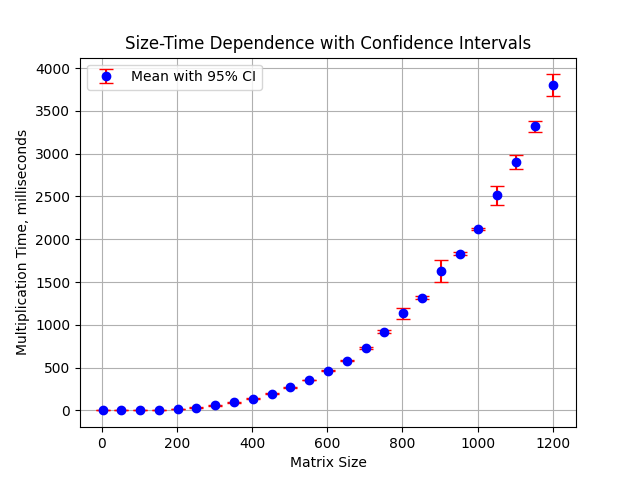
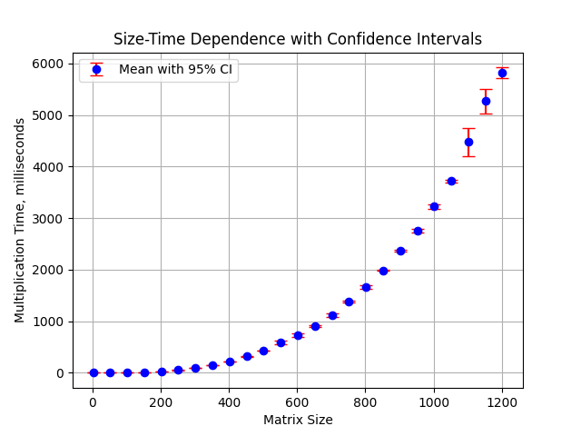
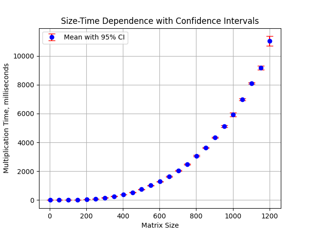
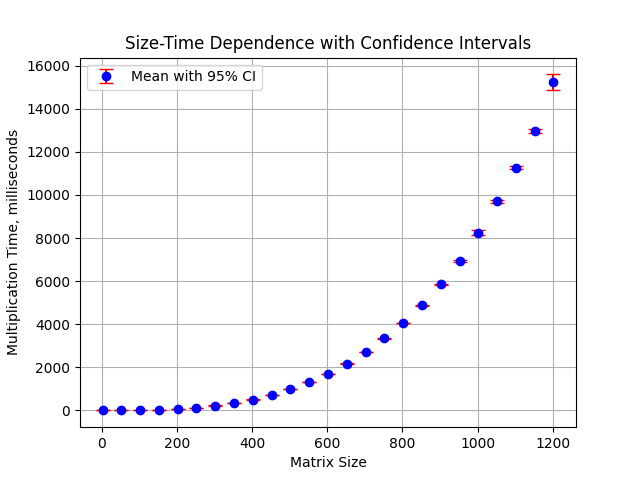

# Lab_2
### Задание 
Модифицировать программу из л/р №1 для параллельной работы по технологии OpenMP.
### Реализация
На языке C++ был реализован алгоритм произведения матриц c поддержкой openmp, последующая проверка корректности результата производилась на Python с использованием библиотеки NumPy. 
### Тесты
Начальный размер матрицы - 2х2, количество шагов - 25, шаг увеличения размера - 50, испытаний для каждого размера - 5
тесты проводились на ryzen 5 7500F 6 ядер 12 потоков
### Результаты
Ниже приведены графики зависимости среднего времени перемножения матриц от её размерности, для каждого испытания были построены доверительные интервалы с точностью 95%
* 12 потоков

[точные значения проведенного испытания](matrix_multiplication_results_12_threads.csv)

* 8 потоков

[точные значения проведенного испытания](matrix_multiplication_results_8_threads.csv)

* 4 потока

[точные значения проведенного испытания](matrix_multiplication_results_4_threads.csv)

* 2 потока

[точные значения проведенного испытания](matrix_multiplication_results_2_threads.csv)

* 1 поток

[точные значения проведенного испытания](matrix_multiplication_results_1_thread.csv)

### Вывод
Использование многопоточности позволило существенно сократить время выполнения умножения матриц. Количество потоков, превышающее максимальное число потоков системы, очевидно, не дало прироста