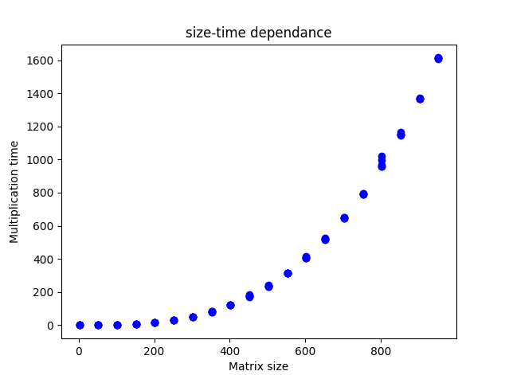

# Lab_2
#### в рамках данной лабораторной работы был дополнен код из lab_1 директивами компилятора для работы с OpenMP. Список внесенных изменений:
* #pragma omp parallel for - каждая итерация цикла перемножения матриц выполняется в своем потоке
* omp_get_max_threads() - получение максимального доступного количества потоков
* #pragma omp simd reduction(+:sum) - Single Instruction, Multiple Data (используется для векторизации внутреннего цикла)

