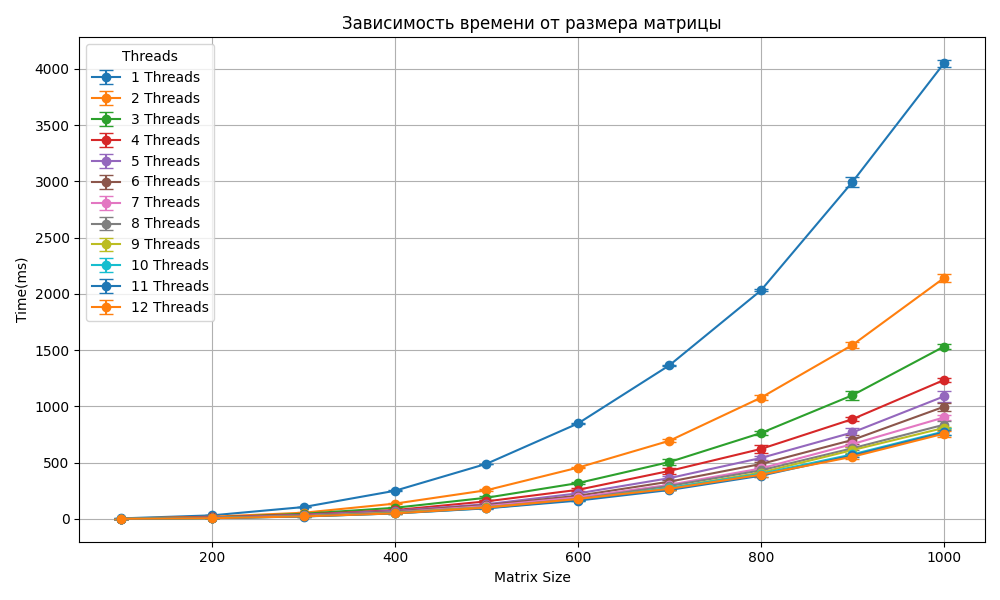
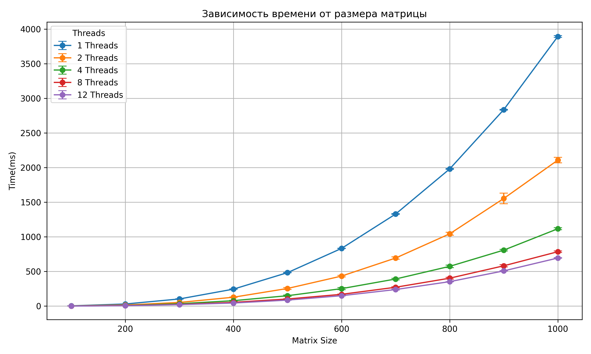
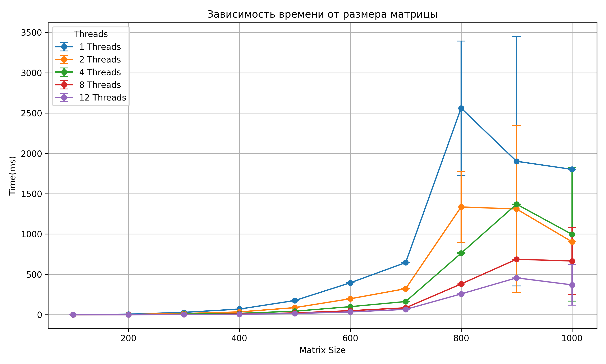

# Lab_3
### Задание 
Модифицировать программу из л/р №1 для параллельной работы по технологии MPI.
### Реализация
На языке C++ был реализован алгоритм произведения матриц c поддержкой MPI, последующая проверка корректности результата производилась на Python с использованием библиотеки NumPy.</br>
Скрипты для запуска на суперуомпьютере представлены в папке Korolev/</br>
Сборка проекта и его запуск на Королёве производились командами:<br>
```
login as: ___
2022-02378@sk.ssau.ru's password: ___
module load intel/mpi4
mpicxx -std=c++11 -O3 -ffast-math main.cpp -o matrix_mpi
sbatch run.sh
squeue -u 2022-02378
```
### Тесты
Начальный размер матрицы - 100х100, количество шагов - 10, шаг увеличения размера - 100, испытаний для каждого размера - 5</br>
тесты проводились на ryzen 5 7500F 6 ядер 12 потоков и на суперкомпьютере Королёв
### Результаты
Ниже приведены графики зависимости среднего времени перемножения матриц от её размерности, для каждого испытания были построены доверительные интервалы с точностью 95%
* запуск на ПК

[точные значения проведенного испытания](PC/stats.csv)





* запуск на Королёве

[точные значения проведенного испытания](Korolev/stats.csv)



### Вывод
Как и для прочих способов распараллеливания задач, разница между 1 и 2 потоками дает двухкратный прирост к скорости, дальнейшее увеличение числа потоков с каждым разом даёт все меньший прирост к скорости. запуск на суперкомпьютере "Сергей Королёв" показал менее стабильную, но более быструю работу