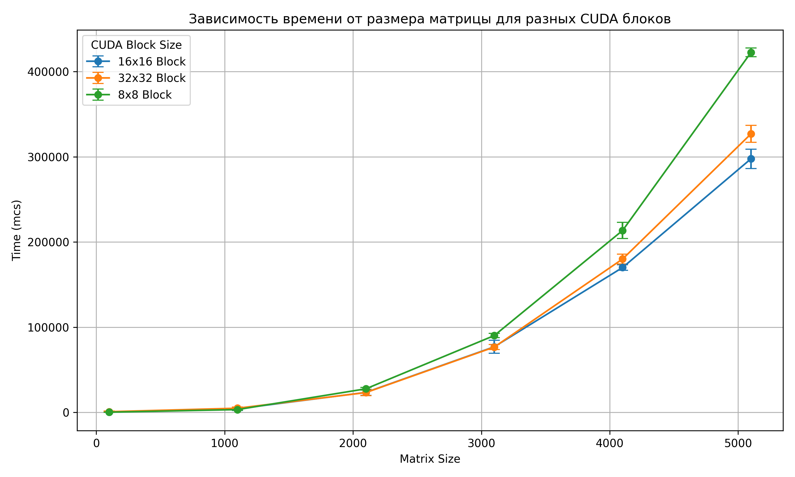
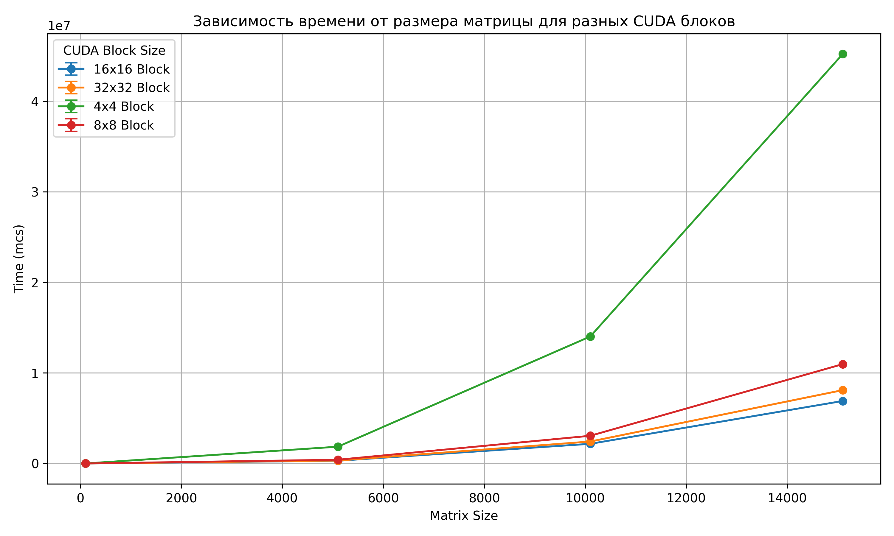

# Lab_4
### Задание 
Модифицировать программу из л/р №1 для параллельной работы по технологии CUDA.
### Реализация
На языке C++ был реализован алгоритм произведения матриц c поддержкой CUDA, последующая проверка корректности результата производилась на Python с использованием библиотеки NumPy.
### Тесты
все тесты проводились на RTX 3070. Архитектура Ampere, 8 гб видео памяти, 5888 ядер CUDA, максимум потоков на блок - 1024, shared memory до 48 Кб на мультипроцессор
### Результаты
Ниже приведены графики зависимости среднего времени перемножения матриц от её размерности, для каждого испытания были построены доверительные интервалы с точностью 95%
* запуск на значениях из прошлых лабораторных для сравнения

[точные значения проведенного испытания](stats_2.csv)

* запуск на более подходящих для технологии CUDA значениях

[точные значения проведенного испытания](stats_1.csv)

### Вывод
По первому графику можно судить о колоссальной прибавке к скорости (по сравнению с предыдущими лабами пришось перейти к микросекундам вместо миллисекунд) 
Тесты на более больших матрицах (а так же на разной размерности блоков) показали: 
При размере блока 4×4 производительность была значительно ниже, особенно на крупных матрицах (например, 15100×15100). Это связано с тем, что при столь малом блоке общее количество блоков растёт, возрастает накладная нагрузка на планировщик GPU, а ресурсы (например, shared memory и регистры) используются неэффективно. 
При увеличении размера блока до 8×8 производительность заметно возрастает, что указывает на более рациональное распределение потоков и снижение накладных расходов. 
Оптимальные результаты были достигнуты при блоках 16×16 и 32×32. Эти конфигурации продемонстрировали наилучшее время выполнения. 
Интересно, что сравнение 16×16 и 32×32 дало неочевидные результаты - 16×16 оказался более быстрым 
Я могу сделать вывод, что (по крайней мере для моей видеокарты) архитектура максимально оптимизирована под блоки размером 16×16 и именно при таком размере блока shared memory, векторные регистры и загрузка данных (плитками) дает наилучший прирост к скорости